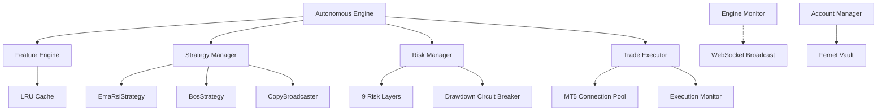

# Velora Engine Architecture

Velora is a production-grade algorithmic trading engine designed for MetaTrader 5 (MT5). It features a multi-threaded, modular architecture that separates data processing from execution and risk management.

## System Overview

### Core Components

1.  **Autonomous Engine (`backend/app/engine/autonomous_loop.py`)**: 
    The central orchestrator. It runs in a background thread, fetching data for symbols and passing it through the pipeline. It uses a `ThreadPoolExecutor` for parallel processing of multiple currency pairs.

2.  **Feature Engine (`backend/app/engine/feature_engine.py`)**: 
    Converts raw OHLCV bars into a `FeatureSet`. Includes technical indicators (EMA, RSI, ATR) and implementations of Regime Detection. Uses an LRU cache to prevent redundant calculations across strategies.

3.  **Strategy Manager (`backend/app/strategies/strategy_manager.py`)**: 
    Evaluates market state against registered strategies. Strategies are stateless classes inheriting from `BaseStrategy`.

4.  **Risk Manager (`backend/app/risk/risk_manager.py`)**: 
    The firewall of the engine. Every trade must pass 9 validation layers (Session, News, Drawdown, Spread, etc.) before execution. It handles dynamic lot sizing based on current account equity.

5.  **Trade Executor (`backend/app/execution/trade_executor.py`)**: 
    Interfaces with the MT5 terminal. Handles order formatting, filling mode detection, and resilient retries. Supports both `live` and `paper` execution modes.

6.  **Engine Monitor (`backend/app/monitoring/engine_monitor.py`)**: 
    A background daemon that assesses system health (Memory, MT5 connection, network) and broadcasts heartbeats via WebSockets.

## Data Flow

1.  **Tick/Candle Arrival**: `mt5_conn` fetches live rates.
2.  **Transformation**: `FeatureEngine` computes indicators.
3.  **Intelligence**: AI Strategy Manager evaluates signals.
4.  **Validation**: `RiskManager` checks constraints (e.g. is news pending?).
5.  **Action**: `TradeExecutor` fires order to MT5.
6.  **Persistence**: `TradeJournal` logs result to SQLite and Supabase.
7.  **Telemetry**: `EngineMonitor` updates the Dashboard.
